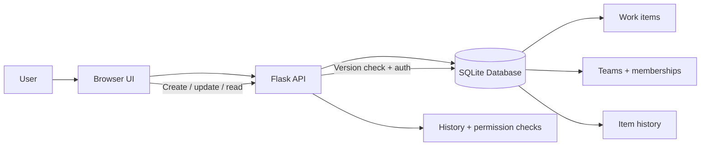

# Architecture Overview

## Main components

### 1) Frontend
The UI is a lightweight browser-based operations dashboard. It exposes:
- work-item list
- item detail panel
- create-item form
- update form
- user/team selection

### 2) Backend
The backend is implemented in Flask and exposes REST-style endpoints for:
- listing items for the current user
- creating a new work item
- fetching item details with history
- updating an item while checking version conflicts
- enforcing team-based authorization

### 3) Data layer
SQLite stores the primary operational data:
- users
- teams
- user-team memberships
- work items
- item history

## Important design decisions

### Authorization
Authorization is enforced on the server. A user can only access items in teams they belong to. This prevents front-end-only enforcement.

### Concurrency
Each item stores a version number. Updates are only accepted when the submitted version still matches the current version. This prevents silent overwrite of concurrent edits.

### History
Every important change is stored in an item_history table. This makes the system auditable and helps explain why a work item changed.

### Operational simplicity
The app intentionally focuses on the core reliability issues in the challenge rather than trying to build a broad enterprise platform.

## Example request flow

1. User opens the dashboard and selects a current user.
2. The browser requests items visible to that user.
3. The Flask app checks team membership.
4. The database returns item rows and recent history.
5. User updates status or priority.
6. The app verifies the version is current before saving.
7. The change is recorded in the history table.

## Known trade-offs

- SQLite is used for simplicity and easy local setup.
- Team-based permissions are intentionally easier to reason about than a large role hierarchy.
- The app is designed as a reviewable prototype rather than a full multi-region production system.
